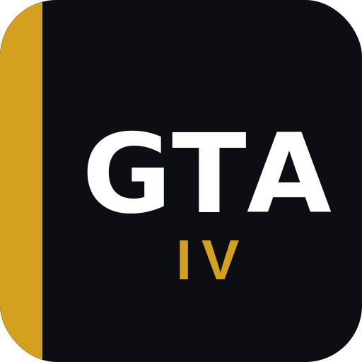

  

Automated setup for Grand Theft Auto IV: The Complete Edition on Steam Deck and Linux handhelds.

GamingTweaksAppliedIV detects your game, installs GE-Proton, applies community mods and fixes, configures display settings, and sets up artwork so you can boot into Game Mode and just play.

## Supported Devices

- Steam Deck (LCD & OLED)
- Lenovo Legion Go / Go S / Go 2
- ROG Ally / Ally X
- MSI Claw 8
- Steam Machine
- General PC (SteamOS, Bazzite, CachyOS)

## What It Does

- Detects GTA IV automatically on your device
- Downloads and configures the latest GE-Proton
- Installs FusionFix (ASI loader, Fusion Overloader, Vulkan support, in-game settings)
- Installs Console Visuals packs to restore Xbox 360/PS3 assets (animations, clothing, HUD, vegetation, and more)
- Installs Various Fixes with optional content (pedestrian traffic lights, Chinatown Wars billboards)
- Installs Radio Restoration to bring back removed licensed music and radio stations
- Installs Higher Resolution Miscellaneous Pack and Vehicle Pack for improved textures
- Writes display config and memory flags tuned for your device
- Applies custom Steam library artwork from SteamGridDB
- Creates non-Steam shortcuts with artwork and GE-Proton for non-Steam copies

## Included Mods

| Mod | Author | Type |
|-----|--------|------|
| FusionFix | ThirteenAG | Required |
| Console Animations | Tomasak | Optional |
| Console Clothing | Tomasak | Optional |
| Console Fences | Tomasak | Optional |
| Console HUD | Tomasak | Optional |
| Console Loading Screens | Tomasak | Optional |
| Console Pedestrians | Tomasak | Optional |
| Console Vegetation | Tomasak | Optional |
| TBoGT HUD Colors | Tomasak | Optional |
| Higher Resolution Misc Pack | Ash_735 | Optional |
| Vehicle Pack 2.4 | Ash_735 | Optional |
| Various Fixes | valentyn-l | Optional |
| Functional Pedestrian Traffic Lights | brokensymmetry | Optional |
| Fixed Misspelled Russian Text | valentyn-l | Optional |
| Chinatown Wars Billboards | Ash_735 | Optional |
| Radio Restoration | Tomasak | Optional |

FusionFix is always installed. All other mods are selected during setup. Console HUD and TBoGT HUD Colors are mutually exclusive.

## Installation

1. Switch to Desktop Mode
2. Open a browser and navigate to this GitHub page
3. Download the **[GamingTweaksAppliedIV.desktop](https://github.com/GalvarinoDev/GamingTweaksAppliedIV/releases/download/v1/GamingTweaksAppliedIV.desktop)** file
4. Right-click the file -> **Properties** -> **Permissions** -> tick **"Is executable"** -> OK
5. Double-click it
   - **First time:** GamingTweaksAppliedIV installs automatically and launches when finished
   - **Already installed:** A menu appears with options to Launch or Uninstall

GamingTweaksAppliedIV checks for updates on every launch.

## After Installation

Click Continue when installation finishes. GamingTweaksAppliedIV will reopen Steam automatically.

- FusionFix settings (Vulkan, FPS cap, AA) can be changed in-game via the FusionFix menu (pause -> FusionFix).
- Radio Restoration patches audio files in place. To undo, use Steam -> GTA IV -> Properties -> Installed Files -> Verify integrity of game files.
- First launch may take longer while Proton sets things up.

## Project Status

Early development. Not yet released.

---

## Credits

GamingTweaksAppliedIV is an installer. This project wouldn't exist without the work from these modders and communities:

**[ThirteenAG](https://github.com/ThirteenAG)** -- [FusionFix](https://github.com/ThirteenAG/GTAIV.EFLC.FusionFix). ASI loader, Fusion Overloader, and hundreds of bug fixes.

**[Tomasak](https://github.com/Tomasak)** -- [Console Visuals](https://github.com/Tomasak/Console-Visuals) and [Radio Restoration](https://github.com/Tomasak/GTA-Downgraders). Console asset restoration and licensed music recovery.

**[valentyn-l](https://github.com/valentyn-l)** -- [Various Fixes](https://github.com/valentyn-l/GTAIV.EFLC.Various.Fixes). Bug fixes and optional content.

**[Ash_735](https://gtaforums.com/topic/887527-ash_735s-workshop/)** -- Higher Resolution Miscellaneous Pack, Vehicle Pack 2.4, and Chinatown Wars Billboards.

**[brokensymmetry](https://github.com/sTc2201)** -- Functional Pedestrian Traffic Lights.

Steam artwork from [SteamGridDB](https://www.steamgriddb.com) -- thanks to [DashWaLLker](https://www.steamgriddb.com/profile/76561198069939620), [vierim](https://www.steamgriddb.com/profile/76561198080195963), [Markster](https://www.steamgriddb.com/profile/76561198193693267), [Gray Mess](https://www.steamgriddb.com/profile/76561198007741451), and [Superligthning](https://www.steamgriddb.com/profile/76561198119365845).

**[Claude](https://claude.ai)** by Anthropic -- assisted in development.

---

> GamingTweaksAppliedIV is not affiliated with Rockstar Games, Take-Two Interactive, or Valve. All trademarks belong to their respective owners.

## License

[MIT License](LICENSE)
