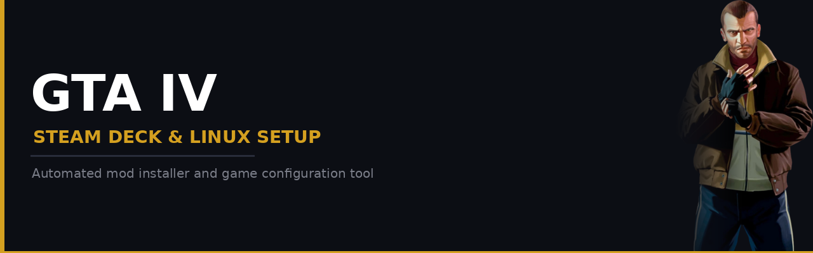

  

**LetsGoBowling - GamingTweaksAppliedIV** is an automated mod installer and game configuration tool for **Grand Theft Auto IV: The Complete Edition** on Steam Deck and Linux handhelds.

Supports Steam Deck LCD/OLED, Lenovo Legion Go series, ROG Ally series, MSI Claw 8, Steam Machine, and PC (SteamOS, Bazzite, CachyOS).

## What It Does

- Detects GTA IV and configures Proton 11 as the compatibility tool
- Installs and configures community mods through a guided UI
- Writes display config and memory flags tuned for your device
- Applies Steam library artwork and creates non-Steam shortcuts

## Included Mods

| Mod | Author | Type |
|-----|--------|------|
| **ThirteenAG** | | |
| [FusionFix](https://github.com/ThirteenAG/GTAIV.EFLC.FusionFix) | ThirteenAG | Required |
| [Xbox Rain Droplets](https://github.com/ThirteenAG/XboxRainDroplets) | ThirteenAG | Optional |
| **Tomasak** | | |
| [Console Visuals](https://github.com/Tomasak/Console-Visuals) -- animations, clothing, fences, HUD, loading screens, peds, vegetation, TBoGT HUD | Tomasak | Optional |
| [Radio Restoration](https://github.com/Tomasak/GTA-Downgraders) | Tomasak | Optional |
| **Attramet** | | |
| [Various Pedestrian Actions](https://gtaforums.com/topic/976318-various-pedestrian-actions/) | Attramet | Optional |
| [More Visible Interiors](https://gtaforums.com/topic/974099-more-visible-interiors/) | Attramet | Optional |
| [Props Restoration](https://gtaforums.com/topic/1004764-props-restoration/) | Attramet | Optional |
| [Restored Trees Position](https://gtaforums.com/topic/984591-restored-trees-position/) | Attramet | Optional |
| [Restored Pedestrians 2.0](https://gtaforums.com/topic/981864-restored-pedestrians/) | Attramet | Optional |
| **valentyn-l** | | |
| [Various Fixes](https://github.com/valentyn-l/GTAIV.EFLC.Various.Fixes) -- includes traffic lights, Chinatown Wars billboards, misspelled Russian text fix | valentyn-l | Optional |
| **Ash_735** | | |
| [Texture Packs](https://gtaforums.com/topic/887527-ash_735s-workshop/) -- Higher Resolution Misc Pack, Vehicle Pack 2.4 | Ash_735 | Optional |

FusionFix is always installed. All other mods are selected during setup. Console HUD and TBoGT HUD Colors are mutually exclusive.

## Installation

1. Switch to Desktop Mode
2. Download the **[GamingTweaksAppliedIV.desktop](https://github.com/GalvarinoDev/LetsGoBowling/releases/download/v1/GamingTweaksAppliedIV.desktop)** file
3. Right-click it -> **Properties** -> **Permissions** -> tick **"Is executable"** -> OK
4. Double-click it -- GamingTweaksAppliedIV installs automatically on first run

GamingTweaksAppliedIV checks for updates on every launch.

## After Installation

- FusionFix settings can be changed in-game via the pause menu -> FusionFix.
- Radio Restoration patches audio files in place. To undo: Steam -> GTA IV -> Properties -> Installed Files -> Verify integrity.
- First launch may take longer while Proton initializes.

## Project Status

Early development. Not yet released.

---

## Credits

GamingTweaksAppliedIV is an installer. This project wouldn't exist without the work from these modders and communities:

**[ThirteenAG](https://github.com/ThirteenAG)** -- [FusionFix](https://github.com/ThirteenAG/GTAIV.EFLC.FusionFix) and [Xbox Rain Droplets](https://github.com/ThirteenAG/XboxRainDroplets). ASI loader, Fusion Overloader, hundreds of bug fixes, and rain droplet effects.

**[Tomasak](https://github.com/Tomasak)** -- [Console Visuals](https://github.com/Tomasak/Console-Visuals) and [Radio Restoration](https://github.com/Tomasak/GTA-Downgraders). Console asset restoration and licensed music recovery.

**[Attramet](https://gtaforums.com/topic/989680-attramets-workshop/)** -- Various Pedestrian Actions, More Visible Interiors, Props Restoration, Restored Trees Position, and Restored Pedestrians. Cut and beta content restoration.

**[valentyn-l](https://github.com/valentyn-l)** -- [Various Fixes](https://github.com/valentyn-l/GTAIV.EFLC.Various.Fixes). Bug fixes and optional content.

**[Ash_735](https://gtaforums.com/topic/887527-ash_735s-workshop/)** -- Higher Resolution Miscellaneous Pack, Vehicle Pack 2.4, and Chinatown Wars Billboards.

**[brokensymmetry](https://github.com/sTc2201)** -- Functional Pedestrian Traffic Lights.

Steam artwork from [SteamGridDB](https://www.steamgriddb.com) -- thanks to [DashWaLLker](https://www.steamgriddb.com/profile/76561198069939620), [vierim](https://www.steamgriddb.com/profile/76561198080195963), [Markster](https://www.steamgriddb.com/profile/76561198193693267), [Gray Mess](https://www.steamgriddb.com/profile/76561198007741451), and [Superligthning](https://www.steamgriddb.com/profile/76561198119365845).

**[Claude](https://claude.ai)** by Anthropic -- assisted in development.

---

> GamingTweaksAppliedIV is not affiliated with Rockstar Games, Take-Two Interactive, or Valve. All trademarks belong to their respective owners.

## License

[MIT License](LICENSE)
